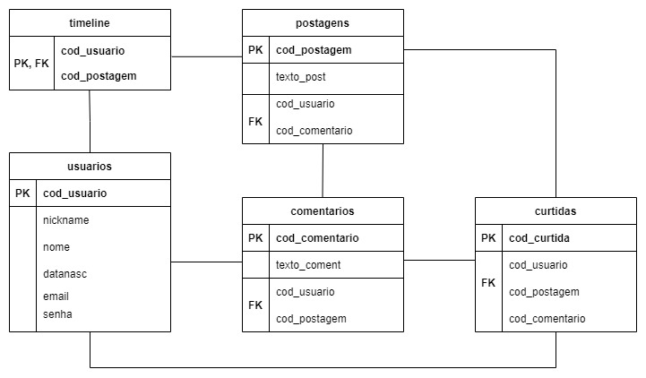

# Dipolo

Projeto Final do Curso Técnico Integrado de Desenvolvimento de Sistemas - Colégio Pedro II - Campus Duque de Caxias

**Integrantes:**
- Felipe Marins Santos Gomes da Silva
- João Pedro Nunes dos Santos
- Louise Ferreira Costa de Oliveira Silva

 ## Descrição do Projeto
 De Toddy x Nescau à política, o debate está muito presente na nossa vida. Com isso em mente, criamos o Dipolo: um espaço para colocar em prática a atividade de debater livremente sobre assuntos diversos com pessoas que compartilham o mesmo interesse. 
 
## Documentação

- [Manual do Usuário](manual.md)
- [Requisitos](requisitos.md)
- [Casos de Uso](casos-de-uso.md)
- [Apresentação](apresentacao.pdf)

**Diagrama de Casos de Uso**

**Modelagem do Banco de Dados**

