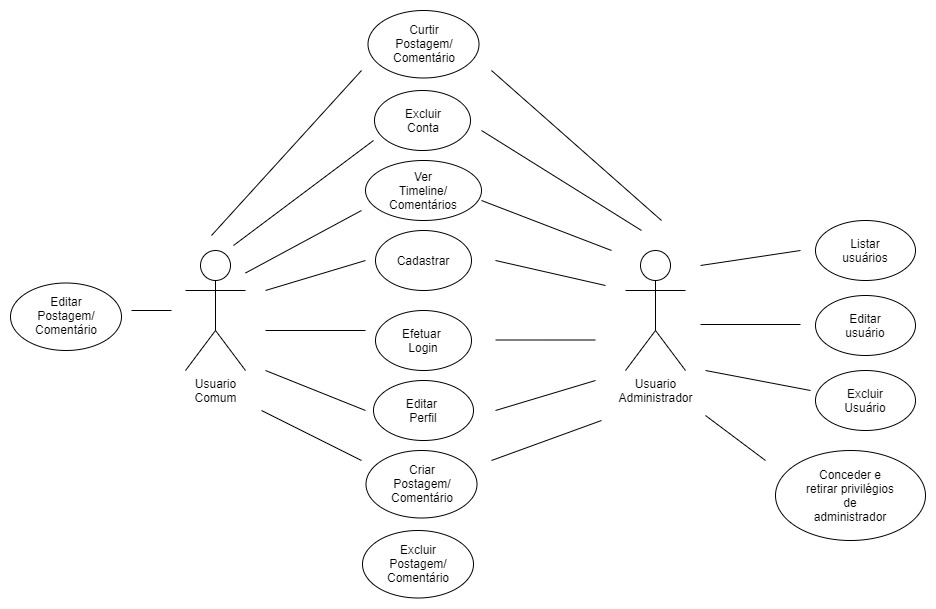

# Documento de Casos de Uso

## Lista dos Casos de Uso

 - [CDU 01](#CDU-01): Cadastro de usuários
 - [CDU 02](#CDU-02): Login
 - [CDU 03](#CDU-03): Editar usuários
 - [CDU 04](#CDU-04): Logout
 - [CDU 05](#CDU-05): Busca de Usuário por Palavra Chave
 - [CDU 06](#CDU-06): Listar Usuários (restrito ao administrador)
 - [CDU 07](#CDU-07): Editar Usuário (restrito ao administrador)
 - [CDU 08](#CDU-08): Excluir Usuário (restrito ao administrador)
 - [CDU 09](#CDU-09): Conceder Privilégios de Administrador
 - [CDU 10](#CDU-10): Retirar Privilégios de Administrador
 - [CDU 11](#CDU-11): Criar Postagem
 - [CDU 12](#CDU-12): Exibir timeline do usuário

## Lista dos Atores

 - Usuário comum
 - Usuário administrador

## Diagrama de Casos de Uso

## Descrição dos Casos de Uso

### CDU 01

Cadastro de usuários

**Fluxo Principal**

 	1. O sistema apresenta um botão "Cadastrar-se"
	2. O usuário clica no botão "Cadastrar-se"
	3. O sistema encaminha o usuário para a página de cadastro
	4. O sistema apresenta um formulário com os campos a serem preenchidos
	5. O usuário insere nickname, nome completo, data de nascimento, email, confirmar email, senha, confirmar senha
	6. O usuário insere o código de administrador se for um administrador
	7. O usuário clica no botão "Enviar"
	8. O sistema valida os campos
	9. O sistema armazena o perfil e informa ao usuário que a operação foi concluída com sucesso
	10. O sistema encaminha o usuário para a tela principal

**Fluxo Alternativo A**

	1. O sistema apresenta um botão "Cadastrar-se"
	2. O usuário clica no botão "Cadastrar-se"
	3. O sistema encaminha o usuário para a página de cadastro
	4. O sistema apresenta um formulário com os campos a serem preenchidos
	5. O usuário insere nickname, nome completo, data de nascimento, email, confirmar email, senha, confirmar senha
	6. O usuário insere o código de administrador se for um administrador
	7. O usuário clica no botão "Enviar"
	8. O sistema informa que existem campos inválidos
	9. O usuário corrige os campos inválidos e clica no botão "Enviar"
	10. O sistema valida os campos
	11. O sistema armazena o perfil e informa ao usuário que a operação foi concluída com sucesso
	12. O sistema encaminha o usuário para a tela principal

**Fluxo Alternativo B**

	1. O sistema apresenta um botão "Cadastrar-se"
	2. O usuário clica no botão "Cadastrar-se"
	3. O sistema encaminha o usuário para a página de cadastro
	4. O sistema apresenta um formulário com os campos a serem preenchidos
	5. O usuário insere nickname, nome completo, data de nascimento, email, confirmar email, senha, confirmar senha
	6. O usuário insere o código de administrador, se for um administrador
	7. O usuário clica no botão "Enviar"
	8. O sistema informa que o campo código de administrador não é válido
	9. O usuário corrige o código de administrador e clica no botão "Enviar"
	10. O sistema valida os campos
	11. O sistema armazena o perfil e informa ao usuário que a operação foi concluída com sucesso
	12. O sistema encaminha o usuário para a tela principal

### CDU 02

Login

**Fluxo Principal**

	1. O sistema apresenta um formulário com os campos nickname e senha
	2. O usuário insere seu nickname e sua senha e clica no botão "Entrar"
	3. O sistema valida o nickname e a senha do usuário
	4. O sistema encaminha o usuário para a tela inicial
	
**Fluxo Alternativo A**

	1. O sistema apresenta um formulário com os campos nickname e senha
	2. O usuário insere seu nickname e sua senha e clica no botão "Entrar"
	3. O sistema informa que o nickname e/ou a senha são inválidos
	4. O usuário corrige as informações de nickname e senha e clica no botão "Entrar"
	5. O sistema valida o nickname e a senha do usuário
	6. O sistema encaminha o usuário para a tela inicial

### CDU 03

Editar Usuário

**Fluxo Principal**

	1. O sistema apresenta um botão "Editar"
	2. O usuário clica no botão "Editar"
	3. O sistema encaminha o usuário para a página de editar dados
	4. O sistema apresenta um formulário com os campos do usuário
	5. O usuário altera os campos desejados
	6. O usuário preenche os campos obrigatórios
	7. O sistema valida os campos
	8. O sistema armazena as alterações e informa ao usuário que que a operação foi concluída com sucesso
	9. O sistema encaminha o usuário para a tela inicial

**Fluxo Alternativo A**

	1. O sistema apresenta um botão "Editar"
	2. O usuário clica no botão "Editar"
	3. O sistema encaminha o usuário para a página de editar dados
	4. O sistema apresenta um formulário com os campos do usuário
	5. O usuário altera os campos desejados
	6. O usuário preenche os campos obrigatórios
	7. O sistema informa que existem campos inválidos
	8. O usuário corrige os campos inválidos 
	9. O usuário preenche os campos obrigatórios e clica no botão "Enviar"
	10. O sistema valida os campos
	11. O sistema armazena as alterações e informa ao usuário que a operação foi concluída com sucesso
	12. O sistema encaminha o usuário para a tela principal

**Fluxo Alternativo B**

	1. O sistema apresenta um botão "Editar"
	2. O usuário clica no botão "Editar"
	3. O sistema encaminha o usuário para a página de editar dados
	4. O sistema apresenta um formulário com os campos do usuário
	5. O usuário altera os campos desejados
	6. O usuário preenche os campos obrigatórios
	7. O sistema informa que a senha atual não correspode à senha cadastrada 
	8. O usuário corrige a senha atual 
	9. O usuário preenche os campos obrigatórios e clica no botão "Enviar"
	10. O sistema valida os campos
	11. O sistema armazena as alterações e informa ao usuário que a operação foi concluída com sucesso
	12. O sistema encaminha o usuário para a tela principal 

### CDU 04

Logout

**Fluxo Principal**

	1. O sistema apresenta um botão "Logout"
	2. O usuário clica no botão "Logout"
	3. O sistema encerra a sessão
	4. O sistema encaminha o usuário pra tela principal
	
### CDU 05

Busca de Usuário por Palavra Chave

**Fluxo Principal**

	1. O sistema apresenta uma barra de pesquisa com um campo de texto
	2. O usuário insere o nickname que deseja encontrar
	3. O usuário clica no botão "Pesquisar"
	4. O sistema valida o texto
	5. O sistema exibe o resultado da busca 

**Fluxo Alternativo A**

	1. O sistema apresenta uma barra de pesquisa com um campo de texto
	2. O usuário insere o nickname que deseja encontrar
	3. O usuário clica no botão "Pesquisar"
	4. O sistema valida o texto
	5. O sistema informa ao usuário que o nickname não existe

**Fluxo Alternativo B**

	1. O sistema apresenta uma barra de pesquisa com um campo de texto
	2. O usuário clica no botão "Pesquisar"
	3. O sistema informa que o usuário deve inserir um texto para busca
	4. O usuário insere o nickname que deseja encontrar
	5. O sistema valida o texto
	6. O sistema exibe o resultado da busca 

### CDU 06

Listar Usuários (restrito ao administrador)

**Fluxo Principal**

	1. O sistema apresenta (um campo ou uma tabela) "Usuários" e exibe todos os usuários cadastrados em forma de lista
	
### CDU 07

Editar Usuário (restrito ao administrador)

**Fluxo Principal**

	1. O sistema apresenta um botão para editar o nickname do usuário
	2. O usuário clica no botão 
	3. O sistema exibe um formulário de edição com o campo nickname
	4. O usuário insere o nickname desejado
	5. O sistema valida o texto e atualiza a página do administrador

**Fluxo Alternativo A**

	1. O sistema apresenta um botão para editar o nickname do usuário
	2. O usuário clica no botão 
	3. O sistema exibe um formulário de edição com o campo nickname
	4. O usuário insere o nickname desejado
	5. O sistema informa que o nickname já existe
	6. O usuário insere outro nickname
	7. O sistema valida o texto e atualiza a página do administrador
	
### CDU 08

Excluir Usuário (restrito ao administrador)

**Fluxo Principal**

	1. O sistema apresenta um menu com um botão "Excluir"
	2. O usuário clica no botão 
	3. O sistema exclui o usuário do banco de dados e atualiza a página do administrador
	
### CDU 09

Conceder Privilégios de Administrador

**Fluxo Principal**

	1. O sistema apresenta um menu com um botão "Conceder privilégios"
	2. O usuário clica no botão 
	3. O sistema altera o campo adm no banco de dados e atualiza a página do administrador
	
### CDU 10

Retirar Privilégios de Administrador

**Fluxo Principal**

	1. O sistema apresenta um menu com um botão "Retirar privilégios"
	2. O usuário clica no botão 
	3. O sistema altera o campo adm no banco de dados e atualiza a página do administrador

### CDU 11

Criar Postagem

**Fluxo Principal**

	1. O sistema apresenta uma caixa de texto 
	2. O usuário insere o texto desejado
	3. O usuário clica no botão "Criar postagem"
	4. O sistema armazena a postagem e atualiza a página inicial

**Fluxo Alternativo A**

	1. O sistema apresenta uma caixa de texto 
	2. O usuário clica no botão "Criar postagem"
	3. O sistema informa ao usuário que ele deve inserir um texto
	4. O usuário insere o texto desejado
	5. O usuário clica no botão "Criar postagem"
	6. O sistema armazena a postagem e atualiza a página inicial

### CDU 12

Exibir timeline do usuário

**Fluxo Principal**

	1. O sistema apresenta um botão "Ver timeline"
	2. O usuário clica no botão "Ver timeline"
	3. O sistema encaminha o usuário para a página da timeline
	4. O sistema lista as postagens do usuário