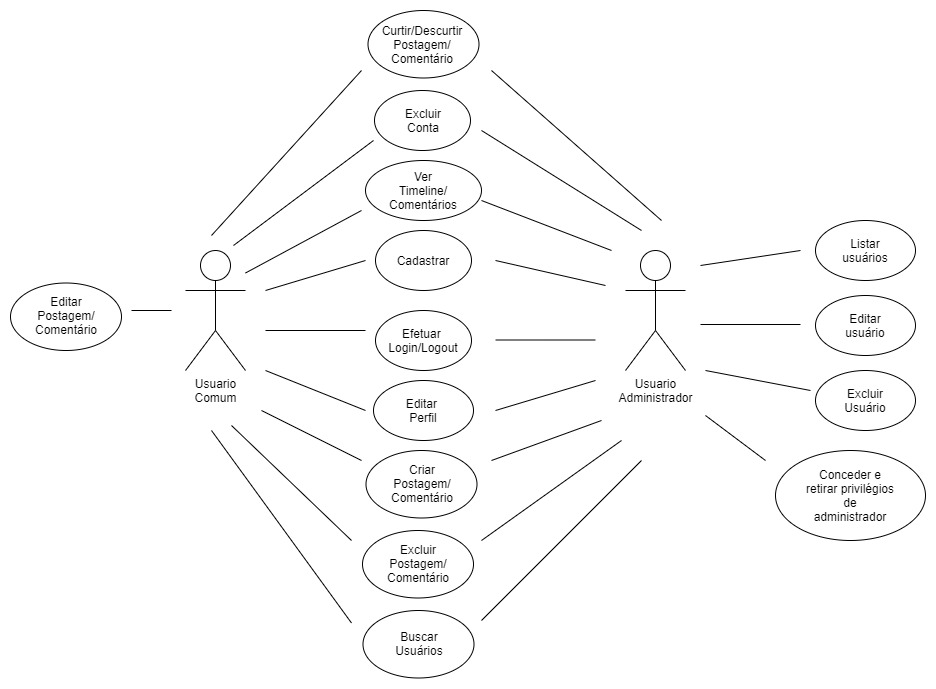

# Documento de Casos de Uso

## Lista dos Casos de Uso

 - [CDU 01](#CDU-01): Cadastro de usuários
 - [CDU 02](#CDU-02): Login
 - [CDU 03](#CDU-03): Editar Dados
 - [CDU 04](#CDU-04): Alterar senha
 - [CDU 05](#CDU-05): Logout
 - [CDU 06](#CDU-06): Busca de Usuário por Palavra Chave
 - [CDU 07](#CDU-07): Listar Postagens (restrito ao administrador)
 - [CDU 08](#CDU-08): Listar Comentários (restrito ao administrador)
 - [CDU 09](#CDU-09): Listar Usuários (restrito ao administrador)
 - [CDU 10](#CDU-10): Editar Usuário (restrito ao administrador)
 - [CDU 11](#CDU-11): Excluir Usuário (restrito ao administrador)
 - [CDU 12](#CDU-12): Conceder Privilégios de Administrador
 - [CDU 13](#CDU-13): Retirar Privilégios de Administrador
 - [CDU 14](#CDU-14): Criar Postagem
 - [CDU 15](#CDU-15): Editar postagem
 - [CDU 16](#CDU-16): Ver timeline do usuário
 - [CDU 17](#CDU-17): Excluir conta
 - [CDU 18](#CDU-18): Excluir postagem
 - [CDU 19](#CDU-19): Criar comentário
 - [CDU 20](#CDU-20): Editar comentário
 - [CDU 21](#CDU-21): Excluir comentário
 - [CDU 22](#CDU-22): Ver comentários
 - [CDU 23](#CDU-23): Curtir postagem/comentário
 - [CDU 24](#CDU-24): Remover curtida de postagem/comentário (apenas a própria curtida)

## Lista dos Atores

 - Usuário comum
 - Usuário administrador

## Diagrama de Casos de Uso

## Descrição dos Casos de Uso

### CDU 01

Cadastro de usuários

**Fluxo Principal**

 	1. O sistema apresenta um botão "Cadastrar"
	2. O usuário clica no botão 
	3. O sistema encaminha o usuário para a página de cadastro
	4. O sistema apresenta um formulário com os campos a serem preenchidos
	5. O usuário insere nickname, nome completo, data de nascimento, email, confirmar email, senha e confirmar senha
	6. O usuário insere o código de administrador se for um administrador
	7. O usuário clica no botão "Enviar"
	8. O sistema valida os campos
	9. O sistema armazena o perfil e informa ao usuário que a operação foi concluída com sucesso
	10. O sistema encaminha o usuário para a tela principal

**Fluxo Alternativo A**

	1. O sistema apresenta um botão "Cadastrar"
	2. O usuário clica no botão 
	3. O sistema encaminha o usuário para a página de cadastro
	4. O sistema apresenta um formulário com os campos a serem preenchidos
	5. O usuário insere nickname, nome completo, data de nascimento, email, confirmar email, senha e confirmar senha
	6. O usuário insere o código de administrador se for um administrador
	7. O usuário clica no botão "Enviar"
	8. O sistema informa que existem campos inválidos
	9. O usuário corrige os campos inválidos e clica no botão "Enviar"
	10. O sistema valida os campos
	11. O sistema armazena o perfil e informa ao usuário que a operação foi concluída com sucesso
	12. O sistema encaminha o usuário para a tela principal

**Fluxo Alternativo B**

	1. O sistema apresenta um botão "Cadastrar"
	2. O usuário clica no botão 
	3. O sistema encaminha o usuário para a página de cadastro
	4. O sistema apresenta um formulário com os campos a serem preenchidos
	5. O usuário insere nickname, nome completo, data de nascimento, email, confirmar email, senha e confirmar senha
	6. O usuário insere o código de administrador, se for um administrador
	7. O usuário clica no botão "Enviar"
	8. O sistema informa que o campo código de administrador não é válido
	9. O usuário corrige o código de administrador e clica no botão "Enviar"
	10. O sistema valida os campos
	11. O sistema armazena o perfil e informa ao usuário que a operação foi concluída com sucesso
	12. O sistema encaminha o usuário para a tela principal

### CDU 02

Login

**Fluxo Principal**

	1. O sistema apresenta um modal com um formulário com os campos nickname e senha
	2. O usuário insere seu nickname e sua senha e clica no botão "Enviar"
	3. O sistema valida o nickname e a senha do usuário
	4. O sistema encaminha o usuário para a tela inicial
	
**Fluxo Alternativo A**

	1. O sistema apresenta um modal com um formulário com os campos nickname e senha
	2. O usuário insere seu nickname e sua senha e clica no botão "Enviar"
	3. O sistema informa que o nickname e/ou a senha são inválidos
	4. O usuário corrige as informações de nickname e/ou senha e clica no botão "Enviar"
	5. O sistema valida o nickname e a senha do usuário
	6. O sistema encaminha o usuário para a tela inicial

### CDU 03

Editar Dados

**Fluxo Principal**

	1. O sistema apresenta um botão de editar dados
	2. O usuário clica no botão 
	3. O sistema encaminha o usuário para a página de editar dados
	4. O sistema apresenta um formulário com os campos dos dados do usuário já preenchidos
	5. O usuário altera os campos desejados
	6. O usuário preenche o campo obrigatório e clica no botão "Confirmar alterações"
	7. O sistema valida os campos
	8. O sistema armazena as alterações e informa ao usuário que a operação foi concluída com sucesso
	9. O sistema atualiza a página

**Fluxo Alternativo A**

	1. O sistema apresenta um botão de editar dados
	2. O usuário clica no botão 
	3. O sistema encaminha o usuário para a página de editar dados
	4. O sistema apresenta um formulário com os campos dos dados do usuário já preenchidos
	5. O usuário altera os campos desejados
	6. O usuário preenche o campo obrigatório e clica no botão "Confirmar alterações"
	7. O sistema valida os campos
	8. O sistema armazena as alterações e informa ao usuário que a operação foi concluída com sucesso
	8. O sistema informa ao usuário que o nickname foi alterado e o pede que faça login novamente
	9. O sistema encaminha o usuário para a página principal 

**Fluxo Alternativo B**

	1. O sistema apresenta um botão de editar dados
	2. O usuário clica no botão 
	3. O sistema encaminha o usuário para a página de editar dados
	4. O sistema apresenta um formulário com os campos dos dados do usuário já preenchidos
	5. O usuário altera os campos desejados
	6. O usuário preenche o campo obrigatório e clica no botão "Confirmar alterações"
	7. O sistema informa que existem campos inválidos
	8. O usuário corrige os campos inválidos e clica no botão "Confirmar alterações"
	10. O sistema valida os campos
	11. O sistema armazena as alterações e informa ao usuário que a operação foi concluída com sucesso
	12. O sistema atualiza a página

### CDU 04

Alterar senha

**Fluxo Principal**

	1. O sistema apresenta um botão "Alterar senha"
	2. O usuário clica no botão 
	3. O sistema encaminha o usuário para a página de alterar senha
	4. O sistema apresenta um formulário com os campos a serem preenchidos, todos obrigatórios
	5. O usuário insere senha atual, nova senha e confirmar nova senha
	6. O usuário preenche os campos e clica no botão "Confirmar alterações"
	7. O sistema valida os campos
	8. O sistema armazena as alterações e informa ao usuário que a operação foi concluída com sucesso
	9. O sistema pede ao usuário que faça login novamente e o encaminha para a página principal 

**Fluxo Alternativo A**

	1. O sistema apresenta um botão "Alterar senha"
	2. O usuário clica no botão 
	3. O sistema encaminha o usuário para a página de alterar senha
	4. O sistema apresenta um formulário com os campos a serem preenchidos, todos obrigatórios
	5. O usuário insere senha atual, nova senha e confirmar nova senha
	6. O usuário preenche os campos e clica no botão "Confirmar alterações"
	7. O sistema informa que existem campos inválidos
	8. O usuário corrige os campos inválidos e clica no botão "Confirmar alterações"
	8. O sistema valida os campos
	9. O sistema armazena as alterações e informa ao usuário que a operação foi concluída com sucesso
	10. O sistema pede ao usuário que faça login novamente e o encaminha para a página principal 

### CDU 05

Logout

**Fluxo Principal**

	1. O sistema apresenta um botão "Logout"
	2. O usuário clica no botão "Logout"
	3. O sistema encerra a sessão
	4. O sistema encaminha o usuário pra tela principal
	
### CDU 06

Busca de Usuário por Palavra Chave

**Fluxo Principal**

	1. O sistema apresenta uma barra de pesquisa com um campo de texto
	2. O usuário insere o nickname que deseja encontrar
	3. O usuário clica no botão "Pesquisar"
	4. O sistema valida o texto
	5. O sistema exibe o resultado da busca 

**Fluxo Alternativo A**

	1. O sistema apresenta uma barra de pesquisa com um campo de texto
	2. O usuário insere o nickname que deseja encontrar
	3. O usuário clica no botão "Pesquisar"
	4. O sistema valida o texto
	5. O sistema informa ao usuário que nenhum usuário foi encontrado

**Fluxo Alternativo B**

	1. O sistema apresenta uma barra de pesquisa com um campo de texto
	2. O usuário clica no botão "Pesquisar"
	3. O sistema informa que o usuário deve inserir um texto para busca
	4. O usuário insere o nickname que deseja encontrar
	5. O sistema valida o texto
	6. O sistema exibe o resultado da busca 

### CDU 07

Listar Postagens (restrito ao administrador)

**Fluxo Principal**

	1. O sistema apresenta um botão que leva para a página do administrador
	2. O usuário clica no botão
	3. O sistema encaminha o usuário para a página do administrador
	4. O sistema apresenta uma coluna "Postagens" que lista todos as postagens salvas no banco de dados

### CDU 08

Listar Comentários (restrito ao administrador)

**Fluxo Principal**
	
	1. O sistema apresenta um botão que leva para a página do administrador
	2. O usuário clica no botão
	3. O sistema encaminha o usuário para a página do administrador
	4. O sistema apresenta uma coluna "Comentários" que lista todos os comentários salvos no banco de dados

### CDU 09

Listar Usuários (restrito ao administrador)

**Fluxo Principal**

	1. O sistema apresenta um botão que leva para a página do administrador
	2. O usuário clica no botão
	3. O sistema encaminha o usuário para a página do administrador
	4. O sistema apresenta uma coluna "Usuários" que lista todos os usuários salvos no banco de dados

### CDU 10

Editar Usuário (restrito ao administrador)

**Fluxo Principal**

	1. O sistema apresenta um botão para editar 
	2. O usuário clica no botão 
	3. O sistema apresenta um modal com um formulário com os campos nickname, nome completo, email, data de nascimento e senha
	4. O usuário altera os campos desejados e clica no botão "Enviar"
	5. O sistema armazena as alterações e atualiza a página 
	
### CDU 11

Excluir Usuário (restrito ao administrador)

**Fluxo Principal**

	1. O sistema apresenta um menu com um botão "Excluir"
	2. O usuário clica no botão 
	3. O sistema apresenta um modal de confirmação 
	4. O usuário confirma a operação
	5. O sistema apaga os dados do usuário do banco de dados e atualiza a página 

**Fluxo Alternativo A**

	1. O sistema apresenta um menu com um botão "Excluir"
	2. O usuário clica no botão 
	3. O sistema apresenta um modal de confirmação 
	4. O usuário cancela a operação
	5. O sistema fecha o modal e o usuário volta para a página 
	
### CDU 12

Conceder Privilégios de Administrador

**Fluxo Principal**

	1. O sistema apresenta um menu com um botão "Conceder privilégios" se o usuário não for administrador
	2. O usuário clica no botão 
	3. O sistema altera o campo adm no banco de dados e atualiza a página 
	
### CDU 13

Retirar Privilégios de Administrador

**Fluxo Principal**

	1. O sistema apresenta um menu com um botão "Retirar privilégios" se o usuário for administrador
	2. O usuário clica no botão 
	3. O sistema altera o campo adm no banco de dados e atualiza a página 

### CDU 14

Criar Postagem

**Fluxo Principal**

	1. O sistema apresenta uma caixa de texto 
	2. O usuário insere o texto desejado
	3. O usuário clica no botão "Criar postagem"
	4. O sistema valida o texto
	5. O sistema armazena a postagem e atualiza a página 

**Fluxo Alternativo A**

	1. O sistema apresenta uma caixa de texto 
	2. O usuário clica no botão "Criar postagem"
	3. O sistema informa ao usuário que ele deve inserir um texto
	4. O usuário insere o texto desejado e clica no botão "Criar postagem"
	5. O sistema valida o texto
	6. O sistema armazena a postagem e atualiza a página 

### CDU 15

Editar postagem

**Fluxo Principal**

	1. O sistema apresenta um botão de editar postagem
	2. O usuário clica no botão 
	3. O sistema apresenta um modal com uma caixa de texto com a postagem já preenchida
	4. O usuário edita o texto da postagem como desejar e clica no botão "Editar"
	5. O sistema valida o texto
	6. O sistema armazena as alterações e informa ao usuário que a operação foi concluída com sucesso
	7. O sistema atualiza a página

**Fluxo Alternativo A**

	1. O sistema apresenta um botão de editar postagem
	2. O usuário clica no botão 
	3. O sistema apresenta um modal com uma caixa de texto com a postagem já preenchida 
	4. O usuário apaga o texto da postagem e clica no botão "Editar"
	5. O sistema informa que o campo precisa ser preenchido
	6. O usuário insere o texto desejado e clica no botão "Editar"
	7. O sistema valida o texto
	8. O sistema armazena as alterações e informa ao usuário que a operação foi concluída com sucesso
	9. O sistema atualiza a página

### CDU 16

Ver timeline do usuário

**Fluxo Principal**

	1. O sistema lista as postagens do usuário na página designada junto com suas respectivas curtidas e opções de editar e/ou excluir

### CDU 17

Excluir conta

**Fluxo Principal**

	1. O sistema apresenta um botão "Excluir conta"
	2. O usuário clica no botão 
	3. O sistema apresenta um modal de confirmação 
	4. O usuário confirma a operação
	5. O sistema apaga os dados do usuário do banco de dados e o encaminha para a página principal

**Fluxo Alternativo A**

	1. O sistema apresenta um botão "Excluir conta"
	2. O usuário clica no botão 
	3. O sistema apresenta um modal de confirmação 
	4. O usuário cancela a operação
	5. O sistema fecha o modal e o usuário volta para a página 

### CDU 18

Excluir postagem

**Fluxo Principal**

	1. O sistema apresenta um botão "Excluir postagem"
	2. O usuário clica no botão 
	3. O sistema apresenta um modal de confirmação 
	4. O usuário confirma a operação
	5. O sistema apaga os dados da postagem do banco de dados e atualiza a página

**Fluxo Alternativo A**

	1. O sistema apresenta um botão "Excluir postagem"
	2. O usuário clica no botão 
	3. O sistema apresenta um modal de confirmação 
	4. O usuário cancela a operação
	5. O sistema fecha o modal e o usuário volta para a página 

### CDU 19

Criar comentário

**Fluxo Principal**

	1. O sistema apresenta uma caixa de texto
	2. O usuário insere o texto desejado
	3. O usuário clica no botão "Criar comentário"
	4. O sistema valida o texto
	5. O sistema armazena o comentário e atualiza a página 

**Fluxo Alternativo A**

	1. O sistema apresenta uma caixa de texto 
	2. O usuário clica no botão "Criar comentário"
	3. O sistema informa ao usuário que ele deve inserir um texto
	4. O usuário insere o texto desejado e clica no botão "Criar comentário"
	5. O sistema valida o texto
	6. O sistema armazena o comentário e atualiza a página

### CDU 20

Editar comentário 

**Fluxo Principal**

	1. O sistema apresenta um botão de editar comentário
	2. O usuário clica no botão 
	3. O sistema apresenta um modal com uma caixa de texto com o comentário já preenchido
	4. O usuário edita o texto do comentário como desejar e clica no botão "Editar"
	5. O sistema valida o texto
	6. O sistema armazena as alterações e informa ao usuário que a operação foi concluída com sucesso
	7. O sistema atualiza a página

**Fluxo Alternativo A**

	1. O sistema apresenta um botão de editar comentário
	2. O usuário clica no botão 
	3.O sistema apresenta um modal com uma caixa de texto com o comentário já preenchido
	4. O usuário apaga o texto do comentário e clica no botão "Editar"
	5. O sistema informa que o campo precisa ser preenchido
	6. O usuário insere o texto desejado e clica no botão "Editar"
	7. O sistema valida o texto
	8. O sistema armazena as alterações e informa ao usuário que a operação foi concluída com sucesso
	9. O sistema atualiza a página

### CDU 21

Excluir comentário 

**Fluxo Principal**

	1. O sistema apresenta um botão "Excluir comentário"
	2. O usuário clica no botão 
	3. O sistema apresenta um modal de confirmação 
	4. O usuário confirma a operação
	5. O sistema apaga os dados do comentário do banco de dados e atualiza a página 
	
**Fluxo Alternativo A**

	1. O sistema apresenta um botão "Excluir comentário"
	2. O usuário clica no botão 
	3. O sistema apresenta um modal de confirmação 
	4. O usuário cancela a operação
	5. O sistema fecha o modal e o usuário volta para a página

### CDU 22

Ver comentários

**Fluxo Principal**

	1. O usuário clica no texto da postagem que deseja ver os comentários
	2. O sistema encaminha o usuário para a página daquela postagem
	3. O sistema lista os comentários da postagem, logo abaixo dela, com suas respectivas curtidas e opções de editar e/ou excluir

### CDU 23

Curtir postagem/comentário

**Fluxo Principal**

	1. O sistema apresenta um botão com polegar pra cima
	2. O usuário clica no botão 
	3. O sistema armazena a curtida no banco de dados, aumenta o contador e colore o botão
	4. O sistema atualiza a página

### CDU 24

Remover curtida de postagem/comentário (apenas a própria curtida)

**Fluxo Principal**

	1. O sistema apresenta um botão com polegar pra cima colorido
	2. O usuário clica no botão 
	3. O sistema remove a curtida do banco de dados, diminui o contador e descolore o botão 
	4. O sistema atualiza a página