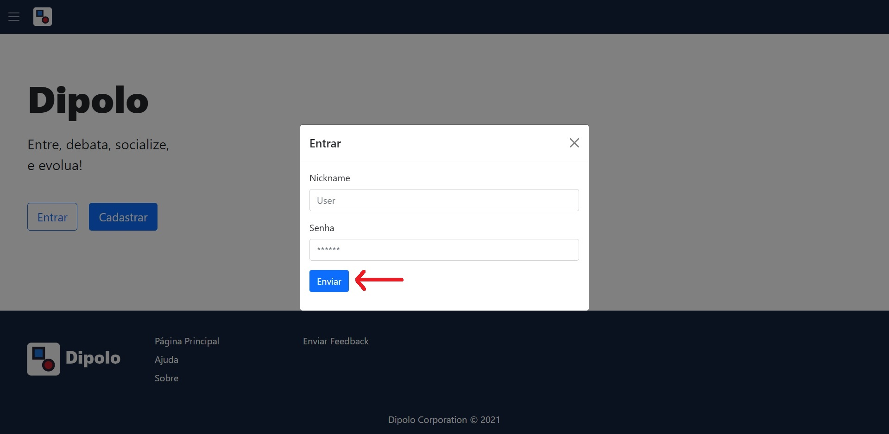

# Manual do Usuário

Nullam vitae velit a eros dignissim bibendum id a enim. Vestibulum hendrerit nisl sed magna gravida, non elementum urna condimentum. Quisque porta tincidunt nunc. Pellentesque habitant morbi tristique senectus et netus et malesuada fames ac turpis egestas. Duis at varius mauris. Quisque molestie ante imperdiet elit blandit, ac volutpat sem efficitur. Donec nec sem tempus, ullamcorper nisl non, blandit tortor. Etiam suscipit rutrum laoreet. Donec facilisis eros ultrices, venenatis quam nec, feugiat ante. Donec ante eros, consequat nec nibh vitae, porta vehicula orci. Duis nec eros et lorem malesuada sodales. Praesent auctor accumsan ipsum, et volutpat ex porttitor eu. Vestibulum facilisis elementum elit, hendrerit mollis velit pretium in. Curabitur tristique vel augue a sodales. Sed malesuada lacinia porttitor.

**Lista das Funcionalidades:**

 - [Cadastrar](#Cadastrar)
 - [Entrar](#Entrar)
 - [Funcionalidade Z](#Funcionalidade-Z)

## Cadastrar

Ao clicar no botão "Cadastrar" na página principal, o usuário será redirecionado à página que contém o formulário para cadastro. Nele, o usuário deve preencher todos os campos, com exceção do campo "Código de administrador", que só deve ser preenchido por administradores.

## Entrar

Ao clicar no botão "Entrar" na página principal, um modal com o formulário de login a ser preenchido aparecerá na tela. O usuário deve preencher os campos de login corretamente para ser autenticado e, consequentemente, redirecionado à página inicial.

## Funcionalidade Z

Sed consequat, diam in imperdiet fringilla, magna metus vehicula ipsum, eu tincidunt massa dolor eget lorem. Integer pellentesque in massa in eleifend. Phasellus a interdum enim. Nullam malesuada nulla eu mi vestibulum imperdiet. Maecenas diam dolor, commodo eget commodo at, congue in libero. Morbi non erat enim. Nunc faucibus lacus urna. Aliquam erat volutpat. Aliquam ex nunc, dictum vel libero sit amet, varius pulvinar risus. Aenean tempus magna at nulla elementum, vel feugiat turpis sodales. Vestibulum viverra congue nibh sed tempor. Morbi faucibus rhoncus dictum. Vestibulum rutrum, nisi id porttitor posuere, purus leo accumsan turpis, sit amet rutrum nulla turpis sit amet ex. Sed ultricies pharetra libero, sed tempor tellus hendrerit eget. Maecenas nibh sem, accumsan ullamcorper felis sed, pharetra semper dolor. Pellentesque ornare lorem eu condimentum tincidunt.

Nam lacinia gravida velit et ultricies. Quisque blandit a ligula at tincidunt. Vestibulum id odio a lectus maximus tempor non in augue. Duis vulputate dui vitae lacus ornare, et eleifend erat cursus. Mauris viverra, massa vel eleifend tempus, nunc justo tempus quam, ac sollicitudin lorem arcu vitae magna. Aliquam eleifend diam neque, at sagittis eros scelerisque vitae. Sed convallis iaculis tempor. Pellentesque in varius velit. Cras ut risus at ligula tristique tincidunt ac a risus. Morbi egestas tincidunt nunc, molestie aliquam nisl imperdiet egestas. Morbi hendrerit augue ac accumsan posuere. Sed a sodales elit. Nullam pharetra rhoncus arcu, eget pharetra massa egestas ut. Sed accumsan auctor dictum. Duis leo enim, pulvinar ut enim a, tempor aliquam dui. Nunc aliquet quam justo, sed aliquet justo tincidunt sed.