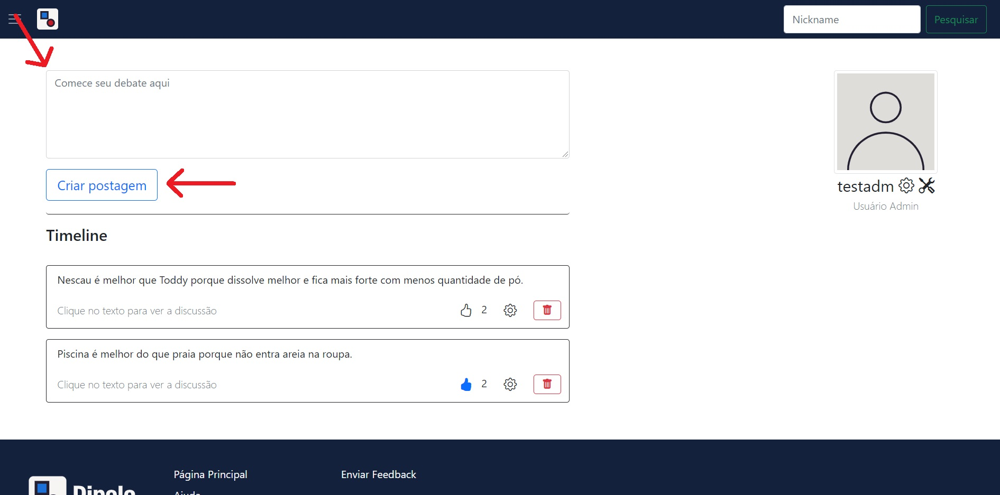

# Manual do Usuário

Nullam vitae velit a eros dignissim bibendum id a enim. Vestibulum hendrerit nisl sed magna gravida, non elementum urna condimentum. Quisque porta tincidunt nunc. Pellentesque habitant morbi tristique senectus et netus et malesuada fames ac turpis egestas. Duis at varius mauris. Quisque molestie ante imperdiet elit blandit, ac volutpat sem efficitur. Donec nec sem tempus, ullamcorper nisl non, blandit tortor. Etiam suscipit rutrum laoreet. Donec facilisis eros ultrices, venenatis quam nec, feugiat ante. Donec ante eros, consequat nec nibh vitae, porta vehicula orci. Duis nec eros et lorem malesuada sodales. Praesent auctor accumsan ipsum, et volutpat ex porttitor eu. Vestibulum facilisis elementum elit, hendrerit mollis velit pretium in. Curabitur tristique vel augue a sodales. Sed malesuada lacinia porttitor.

**Lista das Funcionalidades:**

 - [Cadastrar](#Cadastrar)
 - [Entrar](#Entrar)
 - [Menu da página principal](#Menu-da-página-principal)
 - [Postar](#Postar)

## Cadastrar

Ao clicar no botão "Cadastrar" na página principal, o usuário será redirecionado à página que contém o formulário para cadastro. Nele, o usuário deve preencher todos os campos, com exceção do campo "Código de administrador", que só deve ser preenchido por administradores.

## Entrar

Ao clicar no botão "Entrar" na página principal, um modal com o formulário de login a ser preenchido aparecerá na tela. O usuário deve preencher os campos de login corretamente para ser autenticado e, consequentemente, redirecionado à página inicial.

## Menu da página principal

Ao clicar no botão existente no canto superior esquerdo da página, 3 opções estarão disponíveis para acesso:
    "Página principal" redireciona para a página principal;
    "Entrar" abre o modal de login;
    "Cadastrar" redireciona para a página de cadastro.

## Postar

Criar uma postagem é bem simples: basta inserir seu argumento na caixa de texto da página inicial e clicar no botão "Criar postagem" em seguida.

