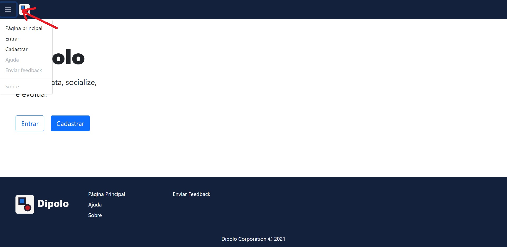
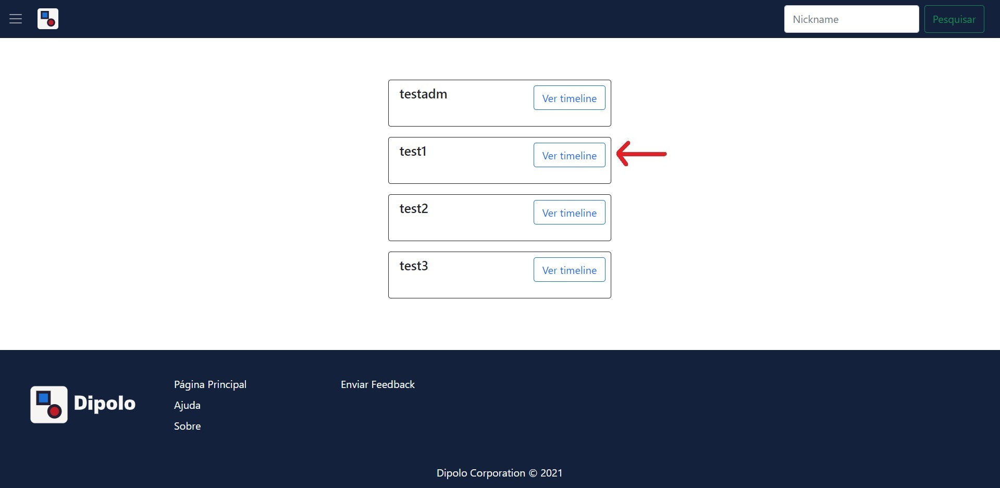
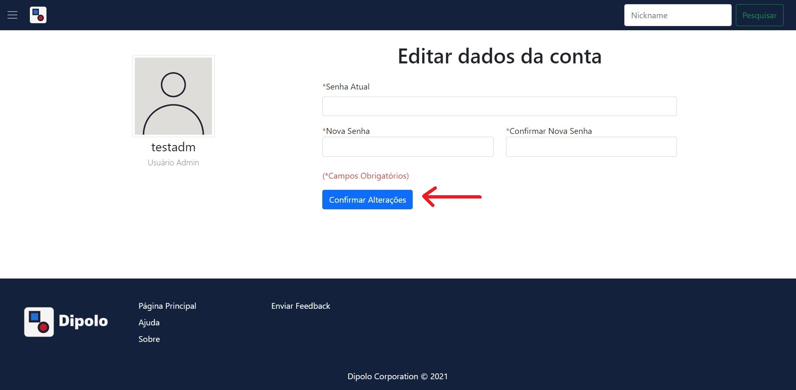
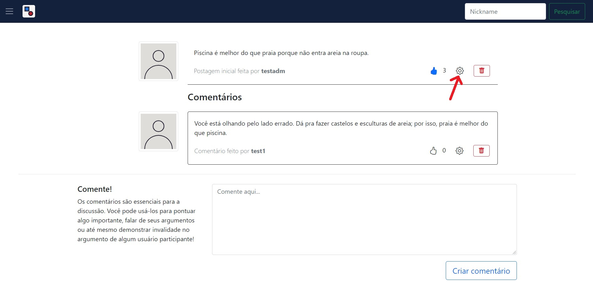
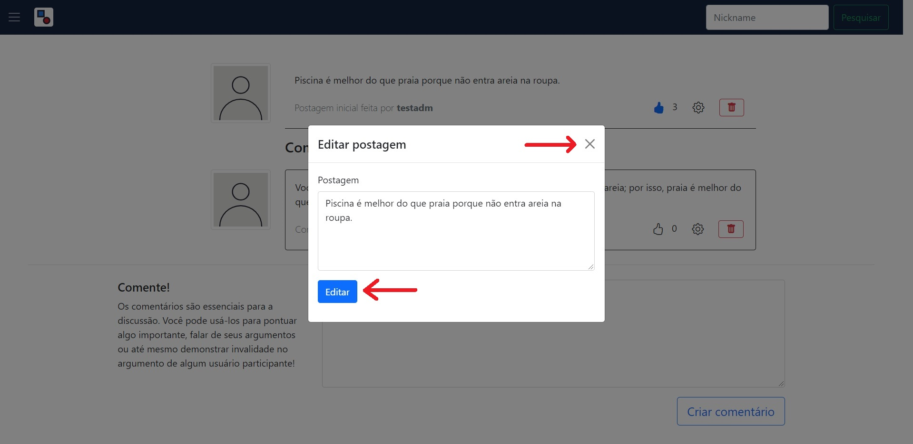
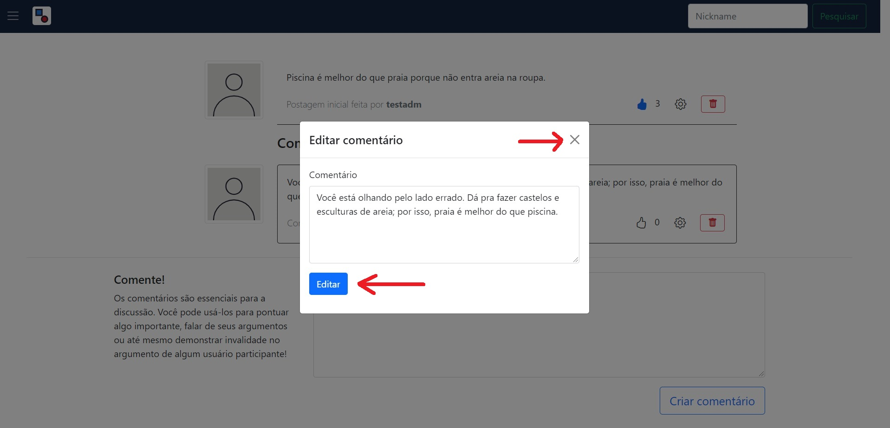
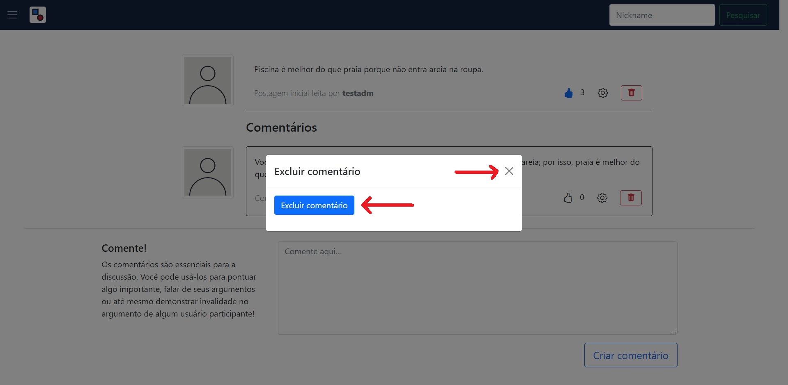

# Manual do Usuário

Nullam vitae velit a eros dignissim bibendum id a enim. Vestibulum hendrerit nisl sed magna gravida, non elementum urna condimentum. Quisque porta tincidunt nunc. Pellentesque habitant morbi tristique senectus et netus et malesuada fames ac turpis egestas. Duis at varius mauris. Quisque molestie ante imperdiet elit blandit, ac volutpat sem efficitur. Donec nec sem tempus, ullamcorper nisl non, blandit tortor. Etiam suscipit rutrum laoreet. Donec facilisis eros ultrices, venenatis quam nec, feugiat ante. Donec ante eros, consequat nec nibh vitae, porta vehicula orci. Duis nec eros et lorem malesuada sodales. Praesent auctor accumsan ipsum, et volutpat ex porttitor eu. Vestibulum facilisis elementum elit, hendrerit mollis velit pretium in. Curabitur tristique vel augue a sodales. Sed malesuada lacinia porttitor.

**Lista das Funcionalidades:**

 - [Cadastrar](#Cadastrar)
 - [Entrar](#Entrar)
 - [Menu da página principal](#Menu-da-página-principal)
 - [Postar](#Postar)
 - [Procurar](#Procurar)
 - [Adicionar/Remover foto de perfil](#Adicionar/Remover-foto-de-perfil)
 - [Editar dados](#Editar-dados)
 - [Alterar senha](#Alterar-senha)
 - [Excluir conta](#Excluir-conta)
 - [Ver discussão](#Ver-discussão)
 - [Curtir/Descurtir postagem](#Curtir/Descurtir-postagem)
 - [Comentar](#Comentar)
 - [Curtir/Descurtir comentário](#Curtir/Descurtir-comentário)
 - [Editar postagem](#Editar-postagem)
 - [Editar comentário](#Editar-comentário)
 - [Excluir postagem](#Excluir-postagem)
 - [Excluir comentário](#Excluir-comentário)

## Cadastrar

Na página principal, clique no botão "Cadastrar" para ser redirecionado à página que contém o formulário para cadastro.  
Nele, você deve preencher todos os campos, se for um administrador, e enviar. Caso contrário, deixe somente o campo "Código de administrador" em branco e envie.

## Entrar

Na página principal, clique no botão "Entrar" para aparecer na tela um modal com o formulário de login.  
Você deve preencher os campos de login corretamente para ser autenticado e, consequentemente, redirecionado à página inicial.

## Menu da página principal

Ao clicar no botão existente no canto superior esquerdo da página, 3 opções estarão disponíveis para acesso:
    "Página principal" redireciona para a página principal;
    "Entrar" abre o modal de login;
    "Cadastrar" redireciona para a página de cadastro.

## Postar

Criar uma postagem é bem simples: basta inserir seu argumento na caixa de texto da página inicial e clicar no botão "Criar postagem" em seguida.

## Procurar usuários

No canto superior direito da página existe uma barra de pesquisa. Digite o nickname do usuário que deseja encontrar e clique no botão "Pesquisar". Para ver a timeline do usuário desejado, clique no botão "Ver timeline" ao lado do nickname correspondente.

## Adicionar/Remover foto de perfil

Na página de edição, o primeiro espaço a aparecer é o de foto de perfil. Para adicionar uma, clique no botão "Escolher arquivo", selecione a foto desejada no seu dispositivo e, por último, clique no botão "Enviar". 
Para remover sua foto de perfil, clique no botão "Remover imagem de perfil".

## Editar dados

Na página inicial, clique no botão de configurações abaixo da sua foto de perfil para ir para a página de editar dados. 
Na página de editar dados, altere os campos desejados, preencha os campos obriatórios e clique no botão "Confirmar alterações".

## Alterar senha

Na página de alteração, clique no botão "Alterar senha" para ser redirecionado para a página de alterar senha. 
Na página de alterar senha, preencha todos os campos, que são obrigatórios, e clique no botão "Confirmar alterações".

## Excluir conta

Na página de alteração, clique no botão "Excluir conta" para aparecer na tela um modal de confirmação. 
No modal, clique no "x" no canto superior direito para cancelar a ação ou no botão "Excluir conta" para confirmar.

## Ver discussão

Para ver uma discussão completa, clique no texto da postagem desejada.

## Curtir/Descurtir postagem

Você pode curtir ou descurtir uma postagem tanto no index como na página da discussão completa. É só clicar no botão com o polegar para cima no canto inferior direito da postagem. 
A postagem será descurtida ao clicar novamente no botão de curtir (após já ter curtido).

## Comentar

Para comentar, é só digitar seu texto na caixa de texto existente na página de discussão e clicar no botão "Criar comentário" em seguida.

## Curtir/Descurtir comentário

Você pode curtir ou descurtir um comentário clicando no botão com o polegar para cima no canto inferior direito do comentário. 
A postagem será descurtida ao clicar novamente no botão de curtir (após já ter curtido).

## Editar postagem

No index ou na página de discussão, clique no botão de configurações canto inferior direito da postagem para aparecer o modal de editar a postagem 
No modal, altere os campos desejados e clique no botão "Editar".

## Editar comentário

Na página de discussão, clique no botão de configurações canto inferior direito da postagem para aparecer o modal de editar o comentário 
No modal, altere os campos desejados e clique no botão "Editar".

## Excluir postagem

No index ou na página de discussão, clique no botão de excluir no canto inferior direito da postagem para aparecer o modal de excluir a postagem 
No modal, clique no "x" no canto superior direito para cancelar a ação ou no botão "Excluir postagem" para confirmar.

## Excluir comentário

Na página de discussão, clique no botão de excluir no canto inferior direito da postagem para aparecer o modal de excluir o comentário 
No modal, clique no "x" no canto superior direito para cancelar a ação ou no botão "Excluir comentário" para confirmar.

