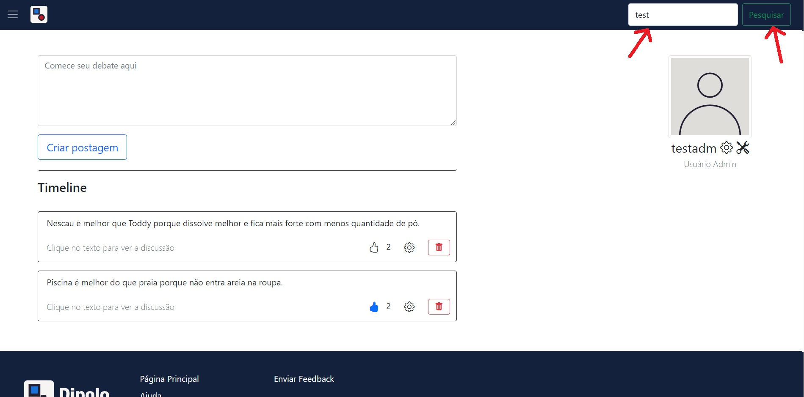

# Manual do Usuário

Nullam vitae velit a eros dignissim bibendum id a enim. Vestibulum hendrerit nisl sed magna gravida, non elementum urna condimentum. Quisque porta tincidunt nunc. Pellentesque habitant morbi tristique senectus et netus et malesuada fames ac turpis egestas. Duis at varius mauris. Quisque molestie ante imperdiet elit blandit, ac volutpat sem efficitur. Donec nec sem tempus, ullamcorper nisl non, blandit tortor. Etiam suscipit rutrum laoreet. Donec facilisis eros ultrices, venenatis quam nec, feugiat ante. Donec ante eros, consequat nec nibh vitae, porta vehicula orci. Duis nec eros et lorem malesuada sodales. Praesent auctor accumsan ipsum, et volutpat ex porttitor eu. Vestibulum facilisis elementum elit, hendrerit mollis velit pretium in. Curabitur tristique vel augue a sodales. Sed malesuada lacinia porttitor.

**Lista das Funcionalidades:**

 - [Cadastrar](#Cadastrar)
 - [Entrar](#Entrar)
 - [Menu da página principal](#Menu-da-página-principal)
 - [Postar](#Postar)
 - [Procurar](#Procurar)
 - [Adicionar/Remover foto de perfil](#Adicionar/Remover-foto-de-perfil)

## Cadastrar

Ao clicar no botão "Cadastrar" na página principal, você será redirecionado à página que contém o formulário para cadastro. Nele, você deve preencher todos os campos, se for um administrador, e enviar. Caso contrário, deixe somente o campo "Código de administrador" em branco e envie.

## Entrar

Ao clicar no botão "Entrar" na página principal, um modal com o formulário de login a ser preenchido aparecerá na tela. Você deve preencher os campos de login corretamente para ser autenticado e, consequentemente, redirecionado à página inicial.

## Menu da página principal

Ao clicar no botão existente no canto superior esquerdo da página, 3 opções estarão disponíveis para acesso:
    "Página principal" redireciona para a página principal;
    "Entrar" abre o modal de login;
    "Cadastrar" redireciona para a página de cadastro.

## Postar

Criar uma postagem é bem simples: basta inserir seu argumento na caixa de texto da página inicial e clicar no botão "Criar postagem" em seguida.

## Procurar usuários

No canto superior direito da página existe uma barra de pesquisa. Digite o nickname do usuário que deseja encontrar e clique no botão "Pesquisar". Para ver a timeline do usuário desejado, clique no botão "Ver timeline" ao lado do nickname correspondente.

## Adicionar/Remover foto de perfil

Na página de edição, o primeiro espaço a aparecer é o de foto de perfil. Para adicionar uma, clique no botão "Escolher arquivo", selecione a foto desejada no seu dispositivo e, por último, clique no botão "Enviar".__
Para remover sua foto de perfil, clique no botão "Remover imagem de perfil".

